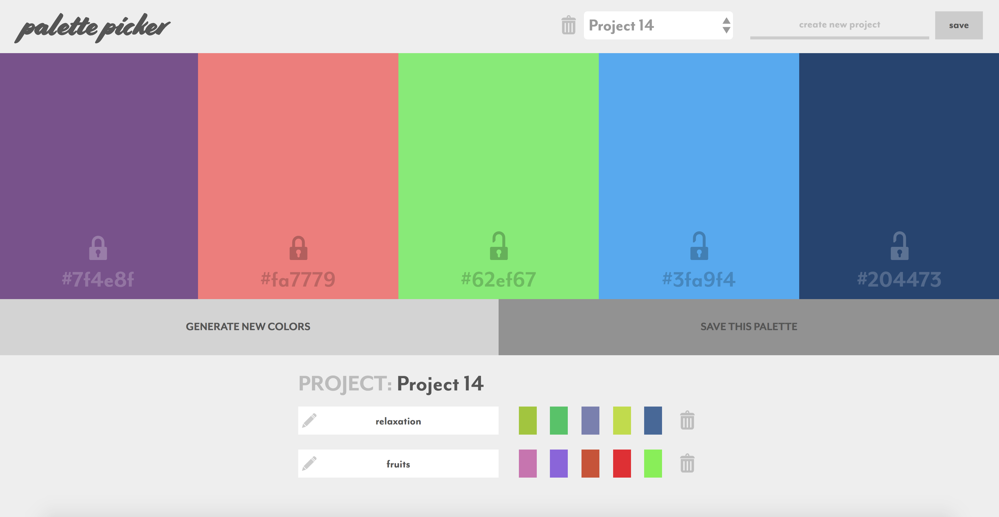

## Palette Picker

Palette Picker is a simple app built for Turing School of Software & Design that enables the user to quickly and easily put together a nice color palette.  Each palette contains five colors.  Projects are named and saved.  Palettes are named, can be modified, and are saved to projects.  Everything is saved to a backend.

The frontend is built using jquery.  The backend is in Node.js/Express/Postgres/Knex.  The styling is my own.  Mobile styling is included.

To see the live version, visit: https://palette-picker-rmorgan323.herokuapp.com/

